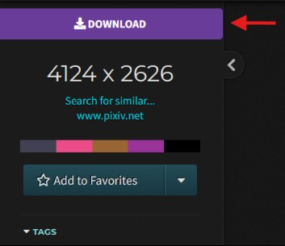

# Wallhaven Image Downloader Userscript

A very basic userscript that downloads the image you are currently on. It doesn't do anything more than that. I mostly created it to download the wallhaven image in a custom naming style I wanted so I made this script.

## Looks

Here is how it looks:

